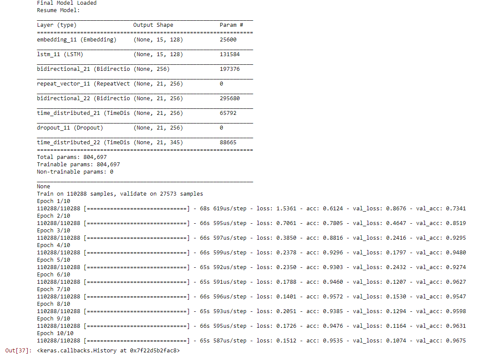
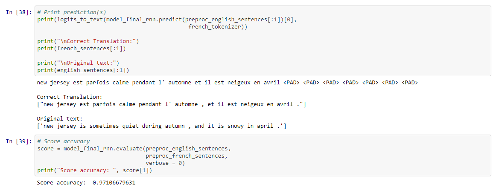
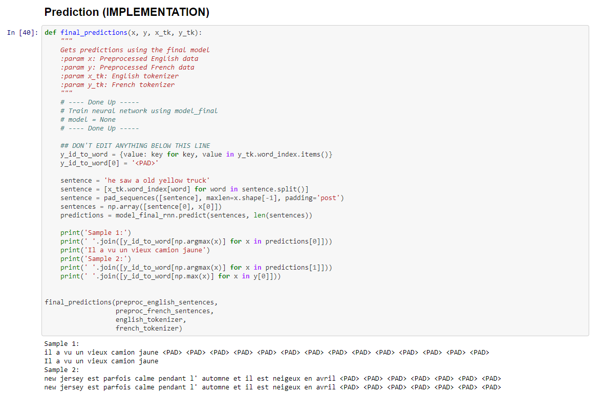

# Machine Translation

:heavy_check_mark: Preprocess - Convert text to sequence of integers.

:heavy_check_mark: Models - Create models which accepts a sequence of integers as input and returns a probability distribution over possible translations.

:heavy_check_mark: Prediction Run the model on English text.

