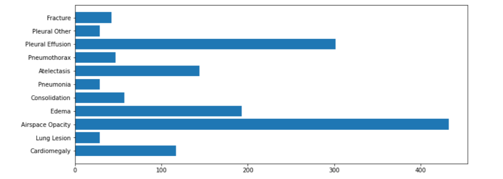
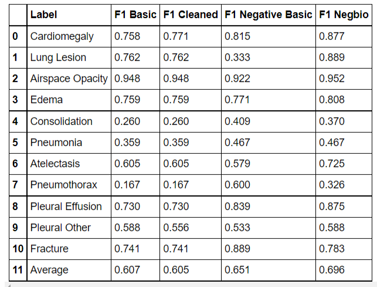
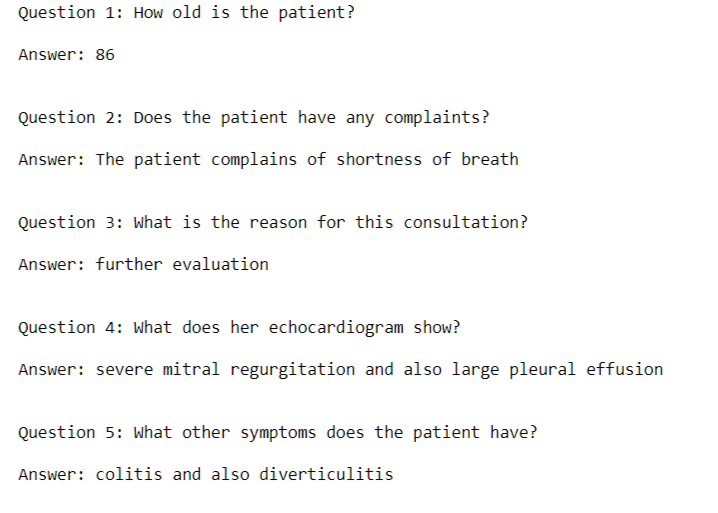

# Natural Language Entity Extraction
Extracting Ground Truth Labels from Radiology Reports

:heavy_check_mark:Extracting disease labels from clinical reports
:heavy_check_mark:Text matching
:heavy_check_mark:Evaluating a labeler
:heavy_check_mark:Negation detection
:heavy_check_mark:Dependency parsing
:heavy_check_mark:Question Answering with BERT
:heavy_check_mark:Preprocessing text for input
:heavy_check_mark:Extracting answers from model output

