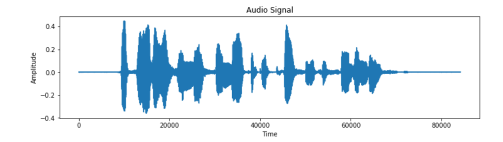
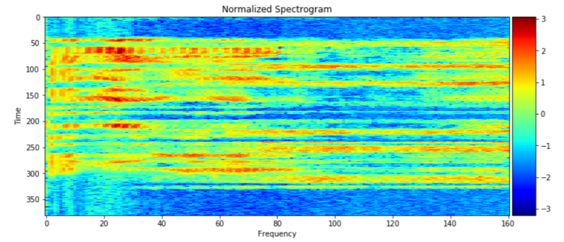
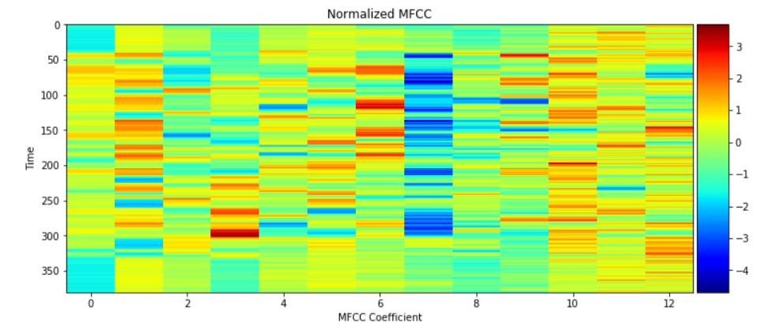
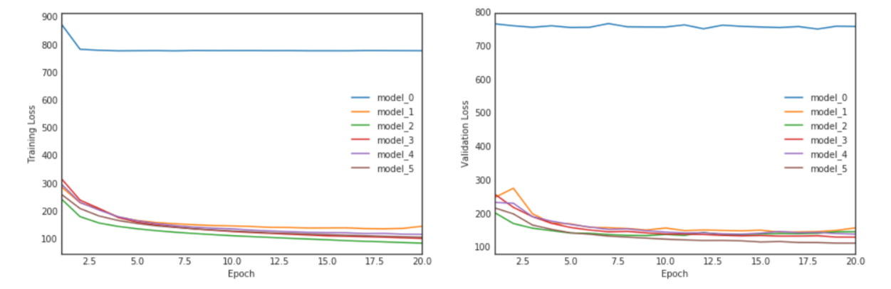

# Speech Recognition with Neural Networks

In this notebook, we build a deep neural network that functions as part of an end-to-end automatic speech recognition (ASR) pipeline! Completed pipeline will accept raw audio as input and return a predicted transcription of the spoken language.

